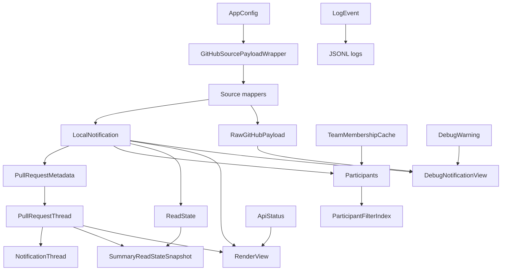

# Architecture

## Domain Model

The domain layer separates boundary records from memory-only runtime models. Zod schemas validate config, GitHub payload wrappers, persistence records, and log/debug records. Internal render, API status, and filtering models use explicit TypeScript types so they can choose efficient runtime representations.
